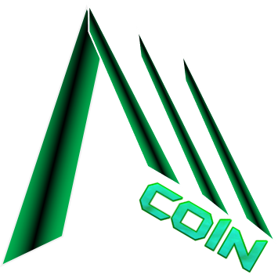

# Summary

Welcome to the go-to portal for in-depth information about the Alltra Chain (ALL) platform and ecosystem and how to interact with them!

The Alltra documentation is separated into three major parts:

**1.** **Alltra Docs**. This part is available in the sections below is for anyone who wants to learn more about Alltra without going into detail that only developers would usually need to know.

**2.** **Developer docs.** Developers wishing to build on top of Alltra and its mobile-centric infrastructure or run validator nodes should consult this [portal](https://developers.alltra.global).

**3. Tutorials.** This part contains various consumer-focused tutorials. It can be accessed here. \*\*\*\*


Join our [Telegram group](https://t.me/)\
Or say hello at: hello@alltra.global

