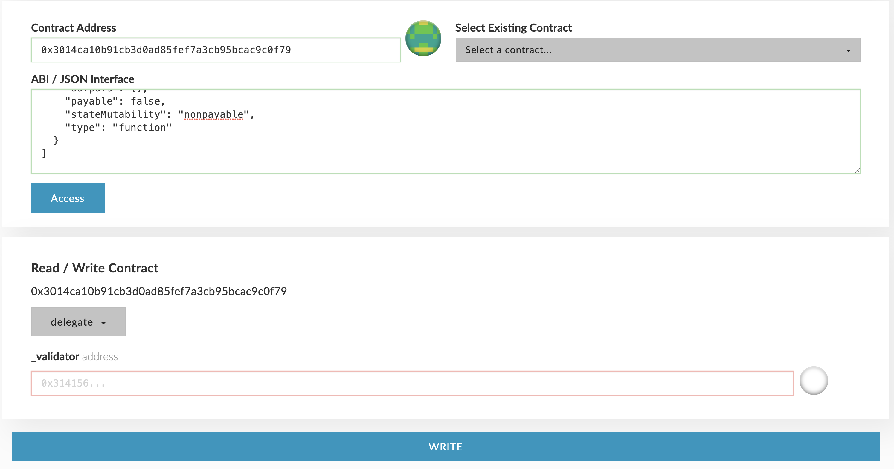

# Stake, Delegate, and Withdraw

Greetings traveller, 

I am ***"ALLTRA"***, your ***A***dvanced ***L***ogistics and ***L***ife-support ***T***echnology ***R***esource ***A***ssistant. 

The basic requirement to become an [Alltra Smartchain](https://alltra.global) validator is to have a stake amount of at least 100,000 Alltra tokens [(ALL coins)](https://www.alltraverse.com/express-checkout). The stake amount is the sum of staked and delegated Alltra tokens [(ALL coins)](https://www.alltraverse.com/express-checkout) associated with an address. This guide walks you through the process of using MEW (MyEtherWallet.com) on the [Alltra Smartchain](https://alltra.global) network.


**Roadmap** - These functionalities will be integrated into our Studio and will not require any technical knowledge in the future.


## Stake

There are two options to stake (both should be executed from the address intended to be the validator):

1. Send Alltra tokens [(ALL coins)](https://www.alltraverse.com/express-checkout) to the [Consensus contract](https://alltra.global/address/0x2aC1a9CaE1E1edBE4Ffd9134342a25C96283B07e) - 0x2aC1a9CaE1E1edBE4Ffd9134342a25C96283B07e on the [Alltra Smartchain](https://alltra.global) network.
2. Call the `stake` function on the [Consensus contract](https://alltra.global/address/0x2aC1a9CaE1E1edBE4Ffd9134342a25C96283B07e) - 0x2aC1a9CaE1E1edBE4Ffd9134342a25C96283B07e on the [Alltra Smartchain](https://alltra.global) network.

## Delegate

Alltra token [(ALL coins)](https://www.alltraverse.com/express-checkout) holders who do not want to run a node themselves but still wish to participate in governing the network can delegate any amount to one of the validators.

Delegating is done by calling the `delegate` function on the [Consensus contract](https://alltra.global/address/0x2aC1a9CaE1E1edBE4Ffd9134342a25C96283B07e) with the validator's address as data (see screenshot from MEW).

## Withdraw

Both stakers and validators can withdraw their Alltra tokens [(ALL coins)](https://www.alltraverse.com/express-checkout), up to the staked or delegated amount, at any time. The withdrawn amount will be deducted from the validator's stake amount. If the stake amount falls below the minimum stake amount, the validator will be removed from the [Alltra Smartchain](https://alltra.global) validators list.

There are two options to withdraw:

1. Call the `withdraw` function on the [Consensus contract](https://alltra.global/address/0x2aC1a9CaE1E1edBE4Ffd9134342a25C96283B07e) with one parameter: the amount to withdraw. This call is for stakers and will reduce the stake amount of the sender's address.
2. Call the `withdraw` function on the [Consensus contract](https://alltra.global/address/0x2aC1a9CaE1E1edBE4Ffd9134342a25C96283B07e) with two parameters: the validator's address and the amount to withdraw. This call is for both stakers (who can use their own address as the parameter) and for delegators to withdraw their delegated stake on a specific validator.

 I am always at your service.
   May fortune favor you.

   ***THANK YOU AND HAPPY TRAVELS***

***ALLTRA***   

