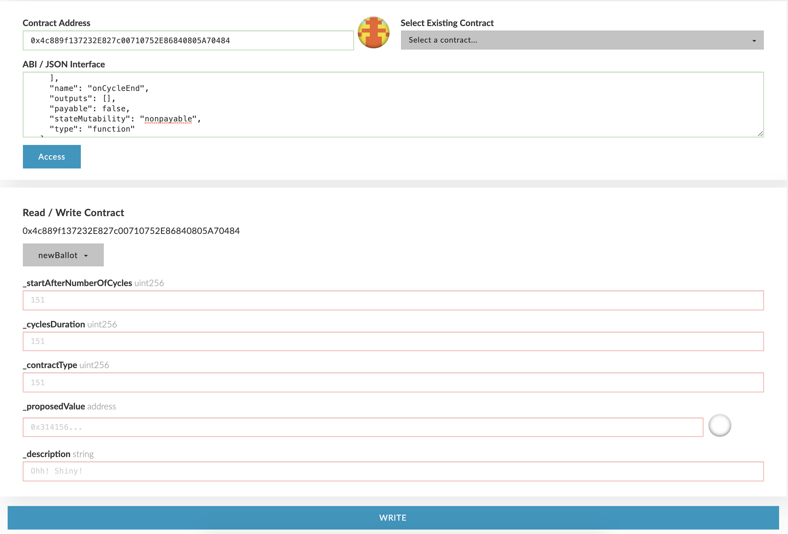
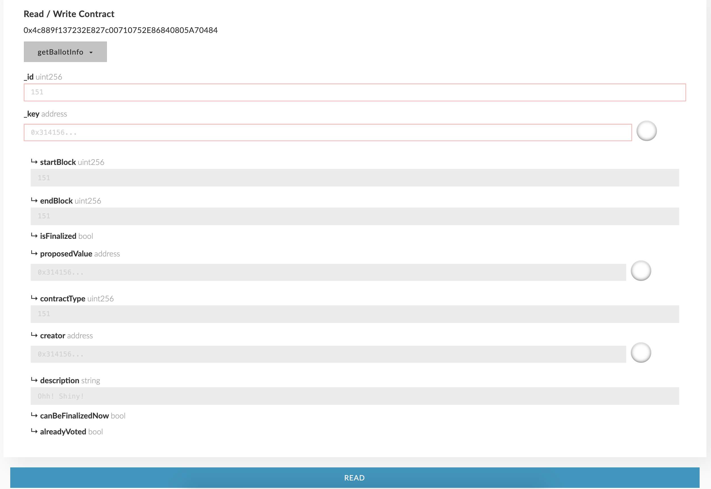
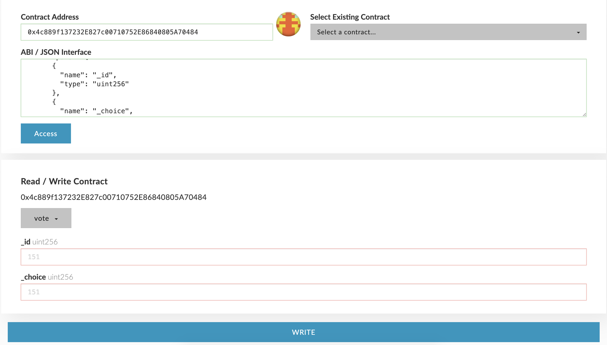

Greetings, traveler,

I am ***ALLTRA***, your ***A***dvanced ***L***ogistics and ***L***ife-support ***T***echnology ***R***esource ***A***ssistant.

***Here is a helpful key for the following documentation.***  
[Alltra Smartchain](https://alltra.global) - Will take you to the Alltra Smartchain Explorer  
  
# Vote

The functionality of the [Alltra Smartchain](https://alltra.global) can be changed by voting on contract implementations. New implementations can be deployed and opened to a vote by validators, allowing others to decide whether to accept or reject the changes.

## Open a New Ballot

To open a new vote, a validator needs to call the `newBallot` function on the [Voting contract](https://alltra.global/address/0xA6aa8cd17cE39568c0D2af8F977069088083edb0) with the following parameters:

* `startAfterNumberOfCycles` - Number of cycles (minimum 1) after which the ballot is open for voting.
* `cyclesDuration` - Number of cycles (minimum 2) for which the ballot will remain open for voting.
* `contractType`:
  * 1 - Consensus
  * 2 - BlockReward
  * 3 - ProxyStorage
  * 4 - Voting
* `proposedValue` - Address of the new implementation deployed for the relevant contract type.
* `description` - A text description that should contain the reason for or changes introduced in the ballot.

## Check Ballot Info

Anyone can check all the ballots that have been created using the `getBallotInfo` function. This function receives two parameters:

* `id` - The ballot ID.
* `key` - The account address.

## Vote

Anyone can vote on open ballots after the start block has passed and before the end block.

It's important to note that at the end of a vote, only validators' votes count towards the final result.

Voting is done by calling the `vote` function, which receives two parameters:

* `id` - The ballot ID.
* `choice` - 1 for accept, 2 for reject.

Some other useful functions on the [Voting contract](https://alltra.global/address/0xA6aa8cd17cE39568c0D2af8F977069088083edb0) are:

## getQuorumState

Returns the state of a specific ballot ID:
* 1 - In progress
* 2 - Accepted
* 3 - Rejected

## getAccepted/getRejected

Returns the number of accepts or rejects for a specific ballot ID.

## activeBallots

Returns an array of active ballot IDs.

---

I am always at your service.  
May fortune favor you.

***THANK YOU AND HAPPY TRAVELS***

***ALLTRA***
